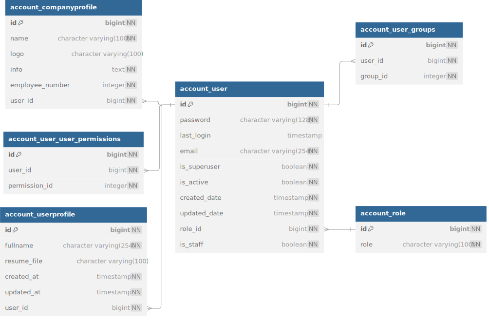

# Accounting

## Authentication and Authorization
We have chosen JWT (JSON Web Token) as our authentication mechanism due to its strong security features and efficient performance.

For implementation, we use the **Simple JWT** package, which provides a convenient and customizable solution for managing tokens.

Roles:

* Superuser: Has full access to the admin panel and all information across the platform.
* Company: Designed for company customers to manage job postings and handle applications.
* User: Intended for job seekers who wish to create profiles, browse, and apply for jobs.

### flow for job seekers:
1. User Authentication: To sign up or log in to our application, users can interact with the `/account/user/login` endpoint. This endpoint accepts the user's email, which should be included in the body of the request.

2. Handling New Users: If the email provided is new (i.e., not yet registered), a new user object is created in the database with that email. Once the account is successfully created, a JWT (JSON Web Token) is generated and sent to the provided email for authentication purposes.

3. Profile Creation: Our Django application has a signal that automatically creates a user profile whenever a new account is registered. This eliminates the need to query the user table for details, as the profile data will be managed in a separate table.

### flow for company customer:
1. Account Creation: Company customers must contact our support team to have an account created. The support team will ensure that the account is set up with the necessary profile details. There is no public endpoint available for company customers to create accounts themselves.

2. Login Process: Once the account is created by support, company customers can log in using their company email through the standard login process.

## model
Our job application system consists of four core models.

### User
User is The main model handles authentication and authorization. It inherits from Django’s `AbstractBaseUser` to allow for customizability and integration. This model uses email as the primary username and includes a foreign key for user roles to facilitate user verification.

### Role
The Role model essentially stores a single CharField called role, which is used for our custom [authorization] (#authentication-and-authorization)system.  

###  UserProfile & CompanyProfile
We use two separate profile models for easier maintenance and to allow for future extensions based on project needs. The details of these profiles are not critical but help ensure that the project aligns closely with real-world scenarios.

## schema

[Full Schema](models.md)

## Testing

### integration test
This app has been thoroughly tested to ensure full functionality and reliability 

### load test

The most critical endpoint in this section is user sign-up, due to its role in writing data to the database. We focused extensively on this endpoint by simulating the creation of 2 million users with randomly generated emails using Locust.

Statistics indicate that under heavy load, the endpoint performs with a **99th** percentile latency of **100 ms** and an average latency of 70 ms, which meets our performance expectations.
For more details on how we implemented heavy load testing, [read the full report.](high-pressure.md) 
NEED LOCUST PICTURE
