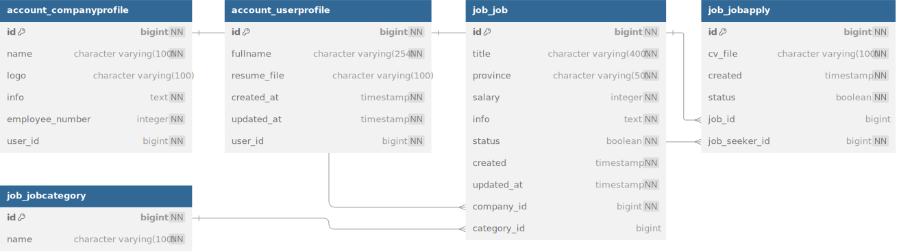

# Details to be Added Shortly
## flow of jobs
The core concepts of this project are outlined in the app. Our primary goal is to help companies find the best candidates, while enabling job seekers to land their dream jobs. To begin, companies should start by posting their job openings.

In this project, our goal is to closely simulate the operations of a real startup by working with real-world data. To achieve this, we sourced a dataset from [Kaggle](https://www.kaggle.com) containing approximately **1.6 million rows of CSV data**.

After performing some initial data cleaning, we proceeded to make **50 requests per second**, saving the data into our database. This process was facilitated using the Locust tool for load testing. [More details can be found here](#)

After enabling companies to save job listings, the most critical endpoint for job seekers became the one that lists all available jobs. Due to the high volume of job listings, querying the job table and displaying all jobs at once was impractical.

Our initial solution was to implement **pagination**, which allowed the endpoint to function properly but resulted in unsatisfactory response times. Upon further investigation, we identified an **N+1 query problem** in this endpoint. After a quick fix, the endpoint became more stable, but our goal was to achieve response times under 100ms due to the importance of this feature.

The final step was implementing **caching**, which we achieved using Redis. With caching in place, the endpoint is now both fast and reliable.[more information on caching](cash.md#)

The remaining endpoint was relatively straightforward to handle. The final requirement was ensuring that job seekers could apply for jobs, and companies could view applications and update their status accordingly.

## models
Our job application system consists of three core models.

### JobCategory
A simple model was implemented for saving multiple job categories. This model is crucial, even in the early stages of the project, as it ensures that companies categorize their saved jobs from the start, preventing data inconsistencies in the job table later on.

### Job
This is the primary model used for saving job listings. Companies are required to provide all critical information necessary to post their job openings.

### JobApply 
This model is used to save job applications from job seekers. Notably, job seekers can currently apply for a job only once and are unable to modify their application details afterward.

## schema

[Full Schema](models.md)
